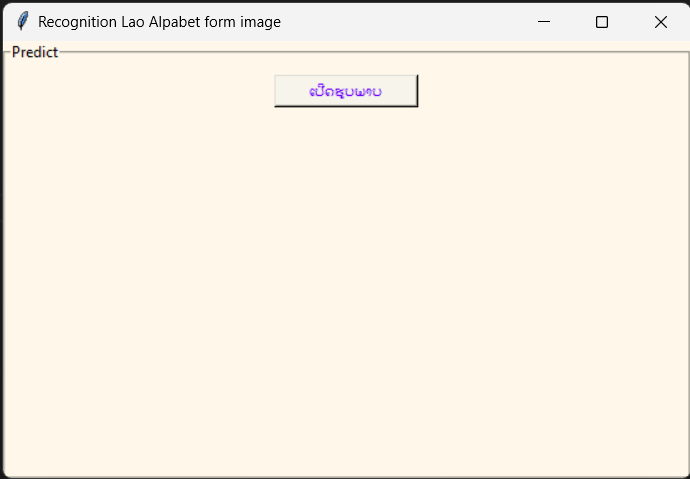

<!-- import tkinter as tk
from tkinter import filedialog, LabelFrame
from PIL import Image, ImageTk

from keras.models import load_model
from skimage.transform import resize
import numpy as np
import cv2 -->
# Python Version 3.10.7

# require modules

### keras Version: 2.11.0

### scikit-image  Version: 0.22.0

### opencv-python  Version: 4.7.0.68

### numpy Version: 1.23.4

## install

pip install keras skimage opencv-python numpy

## main file: gui.py

<!-- this project was created in year 3 of my education -->
<!-- This project was part of a final exam in digital image processing.-->
 
This project was part of a final exam in digital image processing.
(2023)
